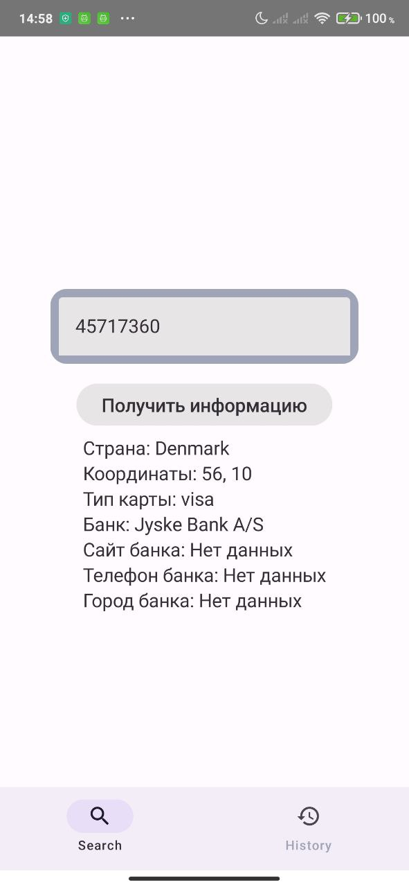
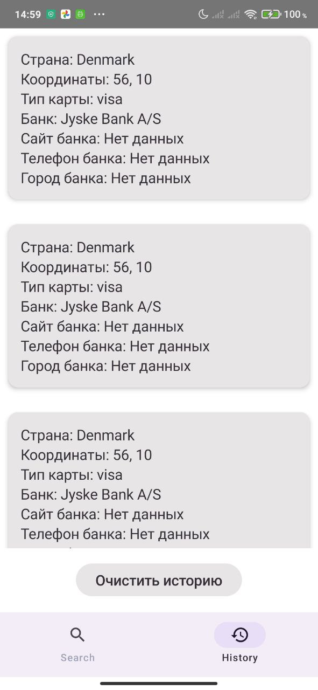

# BinListInfo

## Описание
**BinListInfo** — это Android-приложение, которое позволяет пользователю получать информацию о банковских картах по их BIN (Bank Identification Number) с использованием API [Binlist.net](https://binlist.net/). Приложение отображает подробную информацию о карте, такую как страна выпуска, тип карты и банк. Также реализована история запросов, чтобы пользователи могли просматривать свои предыдущие запросы.

### Особенности:
- Поиск информации по банковской карте по введенному BIN.
- Поддержка сохранения истории запросов.
- Простое и удобное управление запросами с использованием современного интерфейса Jetpack Compose для навигации использована библиотека Navigation Compose 
- Асинхронные запросы с использованием Coroutines для плавной работы.
- Внедрение зависимостей через Koin для упрощения архитектуры.

## Стек технологий
В проекте использован следующий стек технологий:

- **Jetpack Compose** — для разработки пользовательского интерфейса.
- **MVVM (Model-View-ViewModel)** — для разделения ответственности в архитектуре.
- **Retrofit** — для взаимодействия с API Binlist.net.
- **Coroutines** — для асинхронных операций и управления потоками данных.
- **Koin** — для внедрения зависимостей.
- **Timber** — для удобного логирования.
- **Material3** — для улучшенного пользовательского интерфейса с компонентами Material Design.

## Скриншоты

### Главный экран

### Экран деталей

